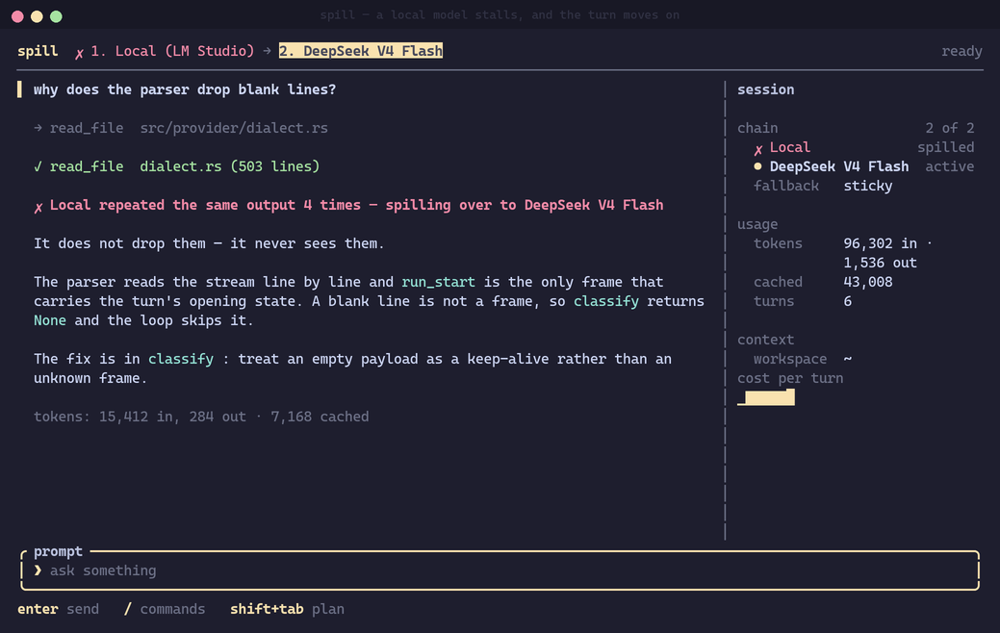
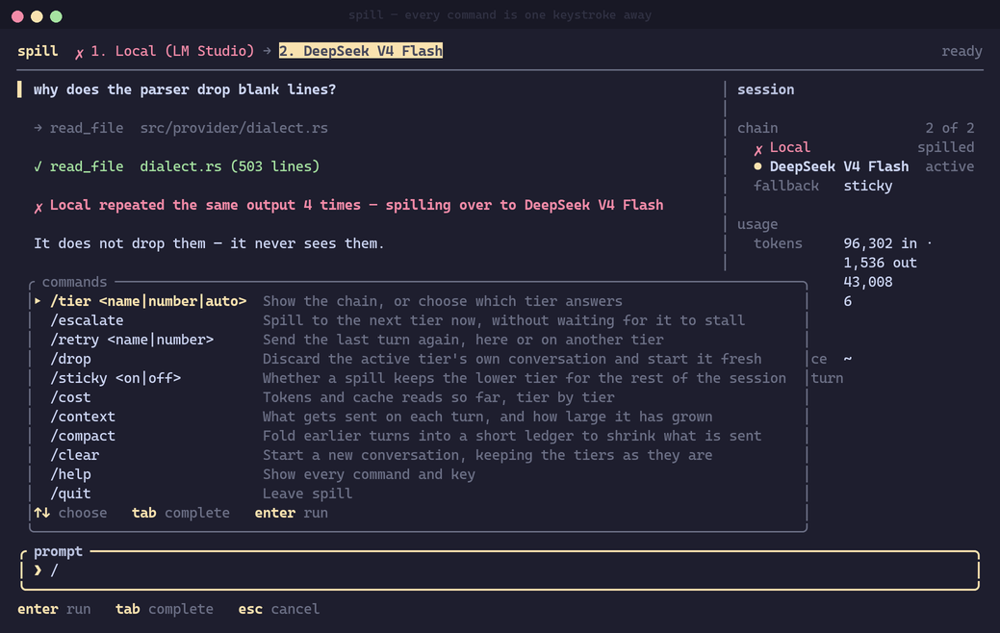
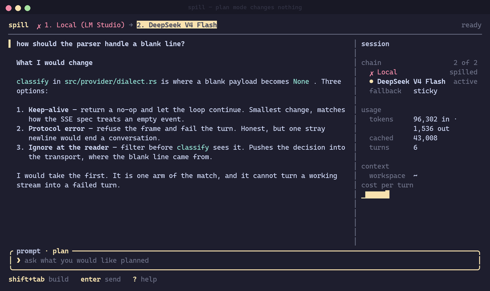
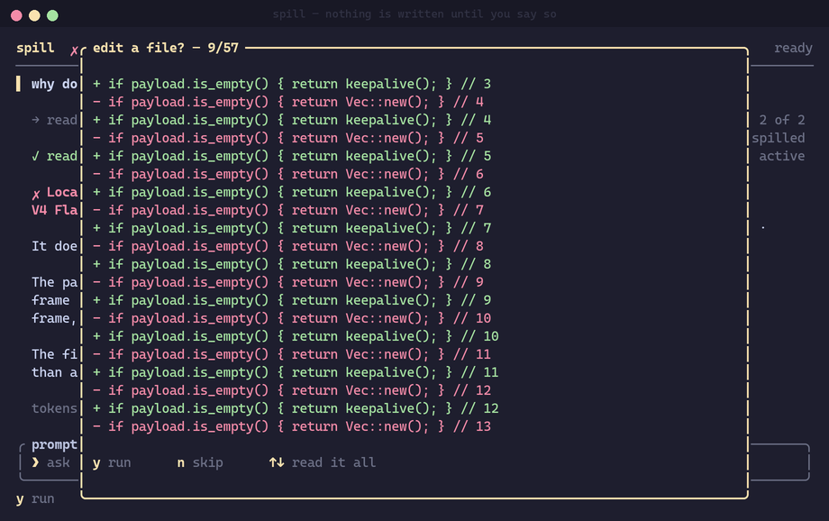

# spill

[](https://github.com/randallyash/spillover/actions/workflows/ci.yml)
[](https://github.com/randallyash/spillover/releases/latest)
[](LICENSE)

**Cheap model first. Expensive model only when it actually fails.**

Run DeepSeek (or a local model). If it loops, stalls, or dies, spill throws that
answer away and retries the **same turn** on Grok. No retyping. No babysitting.
The paid model stays unspent until it is needed.



```
tier 1   DeepSeek V4 Flash     cheap — tried first, every turn
tier 2   Grok 4.6              reached only when tier 1 misbehaves
```

Built for people who want a fast cheap model in the loop all day, and a frontier
model on retainer — not the other way around.

## What is unique

Other tools make you notice the cheap model hanging, cancel, and paste the prompt
into the expensive one. spill treats that as the product:

- **Failover is automatic.** Loop, stall, silence, or a dead endpoint — the turn
  moves on, with the reason on screen *before* the next model starts talking.
- **The wasted answer is thrown away.** Grok starts from *your* question, not from
  DeepSeek's half-finished loop. Approved writes stay; `/undo` takes them back.
- **Consult, don't hand over.** Default: keep DeepSeek driving, spend Grok on one
  narrow question. Escalating (Grok takes the session) is opt-in, because it is
  the expensive mistake.
- **A stall you can argue with.** `/why` prints every counter, including the ones
  that did not fire. Every spill is also a JSONL line you can `jq`.
- **Plan mode cannot write.** `Shift+Tab` withholds the write tools. A hallucinated
  `write_file` is refused before it reaches disk.

It is an agent, not a chat window: it reads, searches, edits, and runs commands,
and asks before anything that writes. When a model thinks out loud (Grok
`thought`, Command Code thinking, OpenAI reasoning), that streams as a dim
*thinking* block above the answer — not as the answer.

## Install

```sh
# macOS / Linux
curl --proto '=https' --tlsv1.2 -LsSf \
  https://github.com/randallyash/spillover/releases/latest/download/spill-installer.sh | sh

# Homebrew
brew install randallyash/spillover/spill

# from source (Rust 1.85+)
cargo install --git https://github.com/randallyash/spillover
```

```powershell
# Windows
powershell -c "irm https://github.com/randallyash/spillover/releases/latest/download/spill-installer.ps1 | iex"
```

Prebuilt archives and the `.msi` are on the [releases page](https://github.com/randallyash/spillover/releases).
AUR recipe is in [`packaging/arch`](packaging/arch) (not submitted yet).

## Setup

```sh
spill
```

With nothing configured, spill looks for a local server (LM Studio, Ollama,
llama.cpp, vLLM) and the first agent CLI on your `PATH`. If it can build a
two-tier chain, it starts. If not, it opens a wizard and will not write a config
that cannot answer.

The arrangement this project actually runs — cheap first, expensive as spillover:

```toml
schema = 1

[general]
workspace = "~"
sticky_fallback = true

[[tier]]
id = "deepseek"
kind = "cli"
preset = "command-code"
model = "deepseek/deepseek-v4-flash"
on_stuck = "consult"

[[tier]]
id = "grok"
kind = "cli"
preset = "grok"
model = "grok-4.6"
```

Copy that to `~/.config/spill/config.toml`, or run `spill setup`. Full comments
live in [`config.example.toml`](config.example.toml). `spill doctor` is the
one-page "does this machine work?" report.

Need a local model instead of Command Code? `preset = "lmstudio"` (or
`base_url = "http://192.168.1.50:1234/v1"`) as tier 1, Grok still as tier 2.

## A spill

```
you     why does the parser drop blank lines?
·       → read_file  src/provider/dialect.rs
·       ✓ read_file  dialect.rs (503 lines)
·       ✗ DeepSeek V4 Flash repeated the same output 4 times
          — spilling over to Grok 4.6
grok    It does not drop them — it never sees them.
```

Stuck means: the model repeated itself, called the same tool in a circle, went
quiet, failed, or burned the step budget (32, configurable). Timeouts are longer
for a box on your LAN than for a hosted CLI.



## Keys and commands

`Enter` send · `Shift+Tab` plan mode · `Esc` stop (or quit) · `Ctrl-N` new session · `Ctrl-P` sessions · `Ctrl-C` quit · `?` help

Type `/` for the menu. The ones a single-model agent cannot offer:

| | |
| --- | --- |
| `/escalate` `/deescalate` `/consult` `/on-stuck` | Force a spill, go back to the first tier, ask for one consult, or set the policy |
| `/why` | Every counter behind the last stall |
| `/tier` `/retry` `/drop` | Pin a model, replay a turn, forget that CLI's session |
| `/undo` | Put back the last approved write (ten deep; refuses if the file moved on) |
| `/new` `Ctrl-N` | New session: empty transcript, first tier |
| `/sessions` `Ctrl-P` | Named history for this workspace; enter to open, `n` new, `d` delete, `r` rename |
| `/session rename <name>` | Name the current session |
| `/allow` `/cost` `/compact` | Skip a prompt, see spend, fold old turns into a ledger |

Writes always ask (`y` / `n`). Read-only shell (`ls`, `git status`, …) does not.
File tools cannot leave the workspace.





## One-shot

```sh
spill -p "what does main.rs do?"
spill -p --yolo "add a doc comment to main.rs"      # writes without asking
spill -p --output-format json "…"                   # for scripts
```

`-p` never resumes a session. Exit `0` on success, `1` on failure.

## License

MIT. See [LICENSE](LICENSE).

<details>
<summary>Reference: <code>/why</code>, the spill log, and <code>spill doctor</code></summary>

`/why` prints the counters the verdict was made from — including the ones that
never fired:

```
Looping Local was abandoned: read_file failed 3 times with the same error (no such file)

decided from:
  steps       6 of 12 used
  repeated    1 identical line(s) in a row, allowed 4
  spans       worst recurring span seen 1 time(s), allowed 4
  calls       1 identical call(s) in a row, allowed 4
  failures    3 in a row, allowed 4
  same error  no such file x3 (budget 3)
  silence     worst 0.3s of a 30.0s idle allowance
  budgets     120.0s first token, 30.0s idle, rate limited at 4 repeats
```

Every spill is appended to `~/.local/state/spill/spills.jsonl` (Linux):

```json
{"at":"2026-09-12T10:00:00Z","calls":{"allowed":4,"class":"no such file","failures":3,"identical":1,"same_error":3},"from":"local","policy":"escalate","reason":"read_file failed 3 times with the same error (no such file)","repeats":{"allowed":4,"lines":1,"span":1},"steps":{"allowed":12,"used":6},"to":"frontier","trigger":"same_tool_error","turn":7,"wait":{"allowance_ms":30000,"first_token_ms":120000,"idle_ms":30000,"phase":"idle","worst_ms":300}}
```

```sh
jq -r '"\(.at) \(.from) -> \(.to // "nowhere") [\(.policy)] \(.trigger): \(.reason)"' \
  ~/.local/state/spill/spills.jsonl
```

`spill doctor` is safe to paste into an issue — keys are never printed, only the
variable names:

```
spill 0.3.0 — doctor

config    /home/you/.config/spill/config.toml
          found at the default path · workspace ~ · sticky fallback on · 32 steps · shell 300s

ok    local    openai  http://localhost:1234/v1
               would use qwen3-coder-30b  (5 ms)
FAIL  offline  openai  http://127.0.0.1:9/v1
               could not reach http://127.0.0.1:9/v1/models: could not connect  (0 ms)
ok    grok     cli     grok
               is installed  (0 ms)
               binary: /home/you/.local/share/mise/installs/node/bin/grok
               sessions: on · opens with -s {session} · resumes with -r {session}
               consult: available read-only · --permission-mode plan

2 of 3 tier(s) usable. spill will start on the first one that answers.
```

</details>
